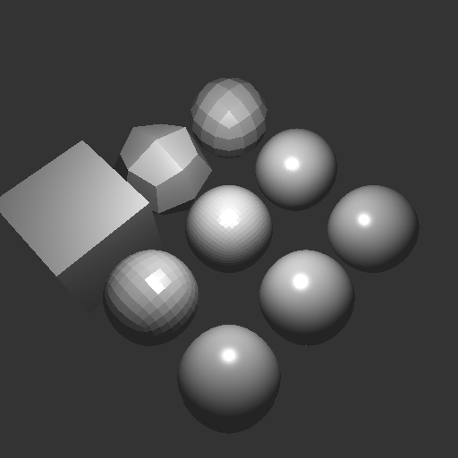
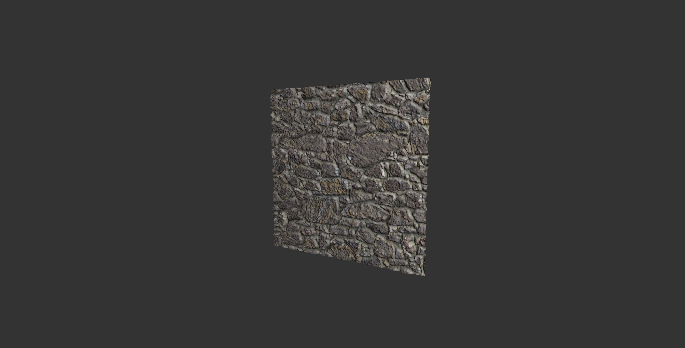
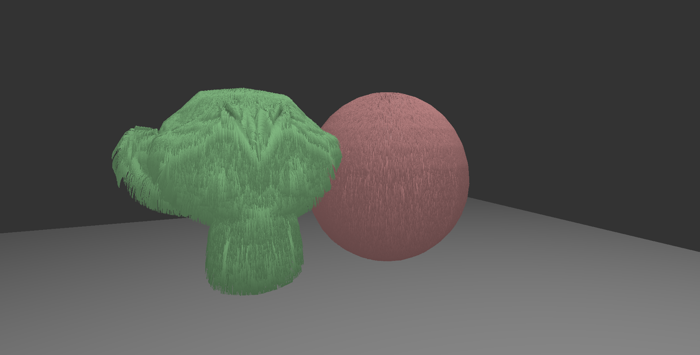

# Assignment 2: Model

Simple openGL shader renderer in C++ displacement mapping and hair growing generation. Developed in the context of the second homework of the fundamentals of computer graphics course held by Prof. Fabio Pellacini.

### Introduction

In your second assignment, you will implement a fragment shader and smooth curves and surfaces and add textures to a simple OpenGL renderer on the GPU. This will show you how a remarkable amount of complexity can be quickly achieved in interactive rendering applications.

### Requirements

You are to implement the code left blank in `model_fragment.glsl` for fragment shading and `tesselation.cpp` for curves and surfaces. You will implement these features.

1.  Compute fragment colors (`shade_fragment.glsl`). Compute fragment colors by implementing ambient light and Blinn-Phong shading with points lights. All variables are already bound for you and the vertex shader is providing the proper transformed data. This code will look remarkably similar to your raytracer code. Note that for this to work, you have to symlink (or manually copy) the shaders in the test directory.

2.  Bezier curves (`tesselation.cpp#subdivide_bezier`). Implement Bezier subdivision using the De Casteljau algorithm applied recursively to each `bezier` segment. In doing so, ensure that the the vertex shared by the two splines for each subdivision has the same index. Implement subdivision for position only, then call the `smooth_tangent` function. Ignore texture coordinates.

3.  Catmull-Clark subdivision (`tesselation.cpp#subdivide_catmullclark`). Implement recursive Catmull-Clark subdivision with the simplified algorithm given in the class. Implement subdivision only for positions `pos`. You will compute normals with either `facet_normals` or `smooth_normals` based on the `smooth` parameter. To simplify development, we have given you a class to compute unique edges `EdgeMap`. To use it, add all triangles and quads, and then look up the edge index with `EdgeMap::edge_index`. To test your mesh, use `facet_normals` right before returning the mesh. For triangles, split them in three quads still using the edge vertices and face center.

4.  Normal smoothing (`tesselation.cpp#smooth_normals`). Implement normal smoothing with the pseudocode given in class. Add normal smoothing to the subdivision code.

5.  Textures.

    1.  Textures are loded into OpenGL for you and texture coordinates are already specified. You only have to implement the code in the fagment shader for it.
    2.  Diffuse and Specular texturing (`model_fragment.glsl`). Compute diffuse color `kd` by multiply the material diffuse response `material_kd` by the value looked up in the texture `material_kd_txt` if the texture is enabled `material_kd_txt_on` (if not, just use the material color). Do the same for the specular color. Use these values to compute lighting.
    3.  Normal mapping (`model_fragment.glsl`). If enabled, copy normal values directly from the normal map. Normals are encoded scaled ans shifted, so get them from the texture by multiplying by 2, subtracting 1 and normalizing them.

### Extra Credit

1. Implement displacement mapping. Take a heavily subdivided quad and a bump map (greyscale image with heights). Move the vertex position along the vertex normal by a quantity proportional to the bump map. Smooth normals at the end.

   

2. Implement hair growing. Take a triangle mesh and grow random hair uniformly on it. For each hair, you need to follow three steps:

   1.  Pick a triangle. For a not so good look, just randomly pick a triangle. For a better distribution, picka triangle proportinal to its area (using `std::discrete_distribution` where the weight are the triangle areas).
   2.  Pick a point on a triangle by selecting baricentric coordinates as _u = 1 - sqrt(r1)_ and _v = r2 * sqrt(r1)_ where _r1_ and _r2_ are random numbers on _[0,1)_.
   3.  Grow hair. For example create a line from the position _p_ to _p + n * l_, where _n_ is the normal and _l_ the hair length (maybe random).

   
